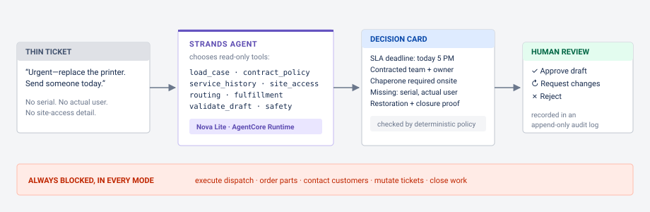
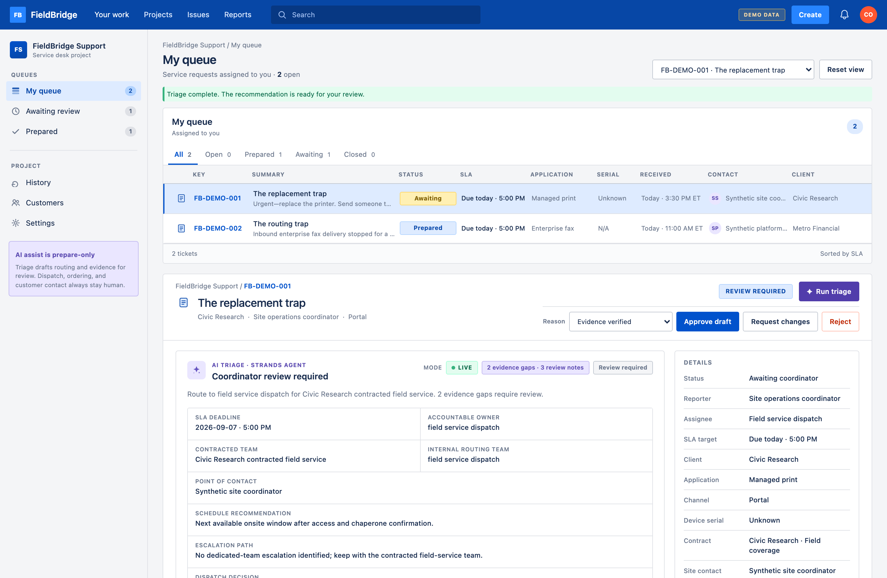
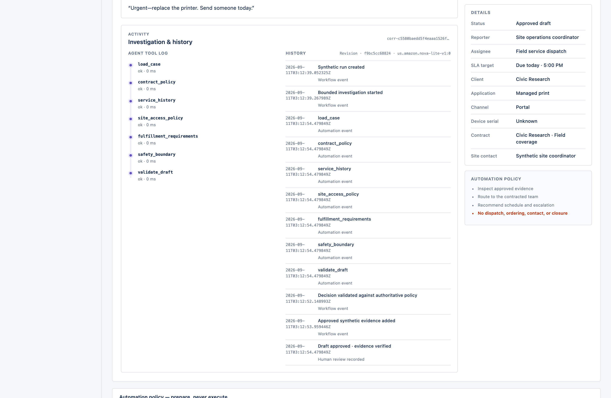

# FieldBridge

**Professional Agents track · Strands + Amazon Bedrock + AgentCore**

> A technician can replace the device perfectly and still leave the customer unable to work.

A coordinator receives: *"Urgent—replace the printer. Send someone today."* It looks routine.
It is not. The site requires a chaperone, the actual user and device serial are missing, and
the replacement must be registered and reconnected to managed workflows before anyone
schedules a visit. FieldBridge finds that hidden work and puts one evidence-linked decision
card in front of the coordinator **before the truck rolls**.


## How it works



1. **A thin ticket arrives.** Two sentences, no serial, no actual user, no site-access detail.
2. **A Strands agent investigates.** It chooses from eight narrow, read-only tools
   (contract, history, site access, routing, fulfillment, safety…) and preserves every
   unknown as an unknown — Nova Lite via Bedrock, running in AgentCore.
3. **Deterministic code stays authoritative.** SLA deadlines, contracted teams, routing,
   evidence requirements, and blocked actions are computed by typed, tested Python — the
   model never overrides them.
4. **A human decides.** Approve the draft, request changes, or reject it. The decision is
   recorded in an append-only audit timeline. The agent never acts.

```text
Allowed: inspect → route → recommend → prepare → record review
Blocked: execute dispatch → order → contact → modify production → close
```

| The agent does | The code guarantees |
| --- | --- |
| Interprets the thin note and selects evidence | SLA deadline, routing, and owners are computed, not guessed |
| Surfaces gaps: serial, actual user, chaperone | Unknowns stay unknown — nothing is invented |
| Drafts the handoff and an information request | Requests are visibly **draft only**; humans send |
| Explains what it checked, with a correlation ID | Every review is audit-logged; no chain-of-thought is exposed |

## See it

**Live demo (AgentCore + Nova Lite):** `https://mh6bxtoj2m.execute-api.us-east-1.amazonaws.com/Prod/`
*(keep the trailing slash)* — open an issue and choose **Run triage**.

**Locally** (Python 3.12):

```bash
python3.12 -m venv .venv
.venv/bin/pip install -e '.[dev]'
.venv/bin/uvicorn fieldbridge.api:app --port 8080
```

Open `http://127.0.0.1:8080` and choose **Run triage**. Without AWS configuration the UI shows a
clearly labeled degraded path — it never pretends a model ran.

### The flagship run

| Thin ticket | What triage reveals |
| --- | --- |
| "Send someone today" | The contract SLA becomes a concrete deadline before scheduling. |
| "Replace the printer" | Serial evidence and the affected user are still unknown. |
| Site access is implicit | A site-provided chaperone must be confirmed before scheduling. |
| No clear owner | The packet names the contracted team, internal routing team, and contact. |
| Implied simple swap | Replacement IP registration and workflow restoration are required. |
| No completion definition | Closure requires workflow verification and a reviewed customer update. |

A second scenario (an enterprise fax issue) follows a different tool path, routes to the
platform owner, and does not invent a printer serial.



After review, every tool event, correction, and decision is visible in the issue's
activity and history panels:



## Architecture


A SAM template defines an API Gateway/Lambda FastAPI façade with WAF, a 24-hour DynamoDB
run-and-review ledger, Secrets Manager HMAC quotas, least-privilege IAM, and an AgentCore
Runtime worker running Strands with Nova Lite. Full details:
[architecture and trust boundaries](docs/ARCHITECTURE.md) · editable
[draw.io diagram](docs/architecture.drawio).

## Verify

```bash
.venv/bin/pytest -q
.venv/bin/python scripts/validate_release.py
.venv/bin/python evals/run_evals.py --base-url http://127.0.0.1:8080
```

The suite contains 15 synthetic product evaluations covering authoritative SLA/routing/safety,
unknown preservation, replacement dependencies, input rejection, idempotency, and review-state
behavior, plus a Playwright test of the critical browser flow.

## Public API

`GET /health` · `GET /api/v1/boundary` · `GET /api/v1/scenarios` ·
`POST /api/v1/runs` (`{scenario_id}` + `Idempotency-Key`) · `GET /api/v1/runs/{run_id}` ·
`GET /api/v1/runs/{run_id}/events` · `POST /api/v1/runs/{run_id}/corrections` ·
`POST /api/v1/runs/{run_id}/reviews` · `POST /api/v1/demo/reset`

Only approved synthetic scenario IDs are accepted — never a free-form prompt or real ticket.
The façade enforces strict schemas, request-size limits, per-caller and global quotas,
idempotency, TTL metadata, generic errors, and browser security headers.

## Evidence status

| Evidence | Status |
| --- | --- |
| Local policy, API, workflow, AWS-adapter, worker, and browser tests | Implemented; verify on this checkout |
| Synthetic 15-case local evaluation | **VERIFIED:** 15/15 passed in three attempts; degraded mode labeled |
| Local Bedrock/Strands run | **VERIFIED 2026-09-07:** both scenarios completed with distinct Nova Lite tool paths |
| AgentCore deployment and trace | **VERIFIED 2026-09-09:** live Nova Lite runs via AgentCore runtime; 15/15 evals passed three consecutive attempts; X-Ray traces captured |
| Public repository, CI, and application URL | **VERIFIED:** public repo with passing Python 3.12 CI; live API serving the UI you see above |
| Public demo video and Builder Center posts | **UNKNOWN / NOT YET VERIFIED** |

The live façade uses the Jira-style service desk redesign on top of the
AgentCore-backed workflow. If Bedrock or AgentCore is unavailable, FieldBridge
fails closed to a deterministic packet labeled
`DEGRADED_REVIEW_REQUIRED` and disables approval rather than fabricating a tool trace.

## Documentation

- [How it works diagram](docs/how-it-works.svg) · [AWS architecture](docs/architecture.svg)
- [Architecture and trust boundaries](docs/ARCHITECTURE.md)
- [Synthetic evidence boundary](docs/EVIDENCE_BOUNDARY.md)

## Synthetic-only boundary

Every organization, contract, ticket, identifier, policy, and result in this repository is
fictional synthetic data informed by generalized field-service experience. FieldBridge contains
no employer/customer tickets, contacts, logs, real serials, credentials, or production
integrations.

## License

MIT. See [LICENSE](LICENSE).
