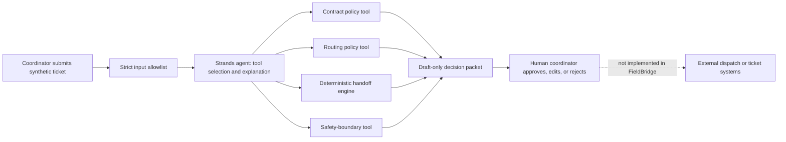

# FieldBridge

**A governed Strands field-service handoff agent for the Agents for Humans Hackathon.**

FieldBridge turns an incomplete synthetic field-service ticket into a structured,
human-approved handoff. It reads a contract profile, routes platform issues to the
right internal owner, identifies missing evidence, applies replacement rules, and
prepares a customer-update task. It never dispatches a technician, orders a part,
contacts a customer, changes a ticket, or closes a ticket.

## The human problem

Field-service coordination breaks when dispatch receives incomplete notes, a
contract-specific SLA is missed, the wrong team owns a platform issue, or a
replacement is treated as a simple swap even though dependent applications and
network registration must be restored first. The people doing dispatch need the
right facts and a short decision packet—not another system that makes promises on
their behalf.

FieldBridge performs the background analysis and surfaces only the decisions a
human coordinator must approve.

## What it does today

- Applies three **fictional, synthetic** contract profiles with different P1/P2
  availability, SLA, local-hot-swap, delivery, and access rules.
- Normalizes unsupported priority pressure back to the contract policy and flags
  it for review.
- Routes enterprise fax and managed-print-access issues to their internal
  platform owners without inventing a printer-serial requirement.
- Requires replacement reconfiguration steps when a swap cannot safely restore
  the dependent workflow.
- Detects missing actual-user contact information and creates a draft customer
  update task.
- Uses strict allowlisted ticket input: no names, email, addresses, credentials,
  attachments, or unbounded notes are accepted.
- Exposes four read-only Strands tools: contract policy, routing policy,
  validated handoff drafting, and the explicit safety boundary.
- Provides a local FastAPI API and repeatable CLI demo.

## Safety boundary

```text
Allowed: inspect → recommend → draft
Blocked: dispatch → order parts → contact customer → close ticket
```

Every result is `draft_only` and requires human approval. FieldBridge does not
connect to a real ticketing system, device, customer, email inbox, inventory
system, or employer environment.

## Public-safe data policy

All organizations, contracts, tickets, serials, users, systems, policies, and
workflows in this repository are fictional synthetic fixtures. The design is
informed by field-service experience, but it does not reproduce employer or
customer systems, ticket records, SLA terms, documentation, credentials, or
contact information. See [the evidence boundary](docs/EVIDENCE_BOUNDARY.md).

## Architecture



The deterministic engine is the safety floor. Strands can inspect policy and
draft a grounded explanation, but cannot change policy or call an action tool.

## Quickstart

```bash
python3 -m venv .venv
.venv/bin/pip install -e '.[dev]'

# Deterministic policy and API tests
.venv/bin/pytest -q
.venv/bin/coverage run -m pytest -q
.venv/bin/coverage report
.venv/bin/ruff check .

# Repeatable synthetic demo
.venv/bin/python -m fieldbridge

# Local API
.venv/bin/uvicorn fieldbridge.api:app --port 8080
```

In a second terminal, inspect the API at `http://127.0.0.1:8080/docs` or send a
synthetic fixture to `POST /api/v1/handoffs`.

## Strands and AWS posture

The optional Strands layer is real code and builds locally with the
`strands-agents` SDK. The deterministic test suite does not need cloud
credentials or a model call.

The contest-ready follow-on is deliberately separate from the tested local
baseline:

1. Configure an approved Bedrock model and invoke the agent only with the
   read-only tools in `strands_layer.py`.
2. Add synthetic state and scheduled sweeps for aging handoffs.
3. Deploy the bounded demo to AgentCore or another AWS runtime.
4. Record the live, ≤5-minute demo: incomplete note → agent investigation →
   review card → human approval → audit evidence.

No AWS credentials are committed. Copy `.env.example` locally if a deployment
environment requires non-secret configuration.

## Scenario map

| Synthetic contract | Support behavior demonstrated |
| --- | --- |
| Northstar Health | P1 four-hour resolution target, P2 next-business-day target, and locally delivered hot-swap candidate when printing can be restored. |
| Civic Research | P2 next-business-day target; replacement remains open until IP and dependent workflow reconfiguration are verified. |
| Metro Financial | P2-only policy; requester pressure cannot silently create a P1, and platform issues route to an internal owner. |

## Current evidence

The initial deterministic implementation has 21 passing tests and 92% branch/
line coverage in the local project environment. The API test suite verifies the
synthetic draft-only mode and rejects unapproved contact data without echoing it
back. This is local test evidence, not a deployed production claim.

## License

MIT. See [LICENSE](LICENSE).
