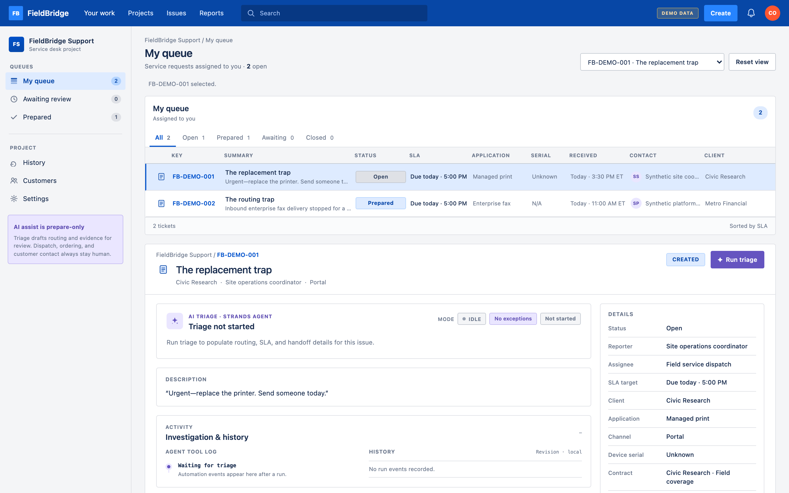
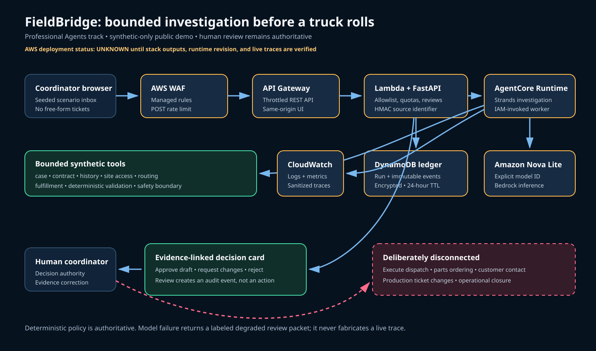

# FieldBridge

**Professional Agents track · Strands + Amazon Bedrock + AgentCore**

> A technician can replace the device perfectly and still leave the customer unable to work.

A coordinator receives: “Urgent—replace the printer. Send someone today.” It looks routine.
It is not. The site requires a chaperone, the actual user and device serial are missing, and a
replacement must be registered and reconnected to managed workflows before anyone schedules a
visit.

FieldBridge investigates that hidden work and brings the coordinator one evidence-linked
decision card before the truck rolls.



## Who it is for

FieldBridge is for field-service coordinators and dispatch leads who turn incomplete tickets
into technician-ready work. Their recurring task is not one lookup: it is reconciling contract
rules, service history, site access, ownership, fulfillment, restoration, and closure evidence
before anyone makes a promise.

FieldBridge prepares the contracted-team route and the onsite decision packet. It does not
execute dispatch. It prevents an incomplete handoff from turning a technically successful visit
into an operational failure.

## The product promise

- Start with a bounded, synthetic thin ticket—not a pre-classified decision form.
- Let a Strands agent choose the relevant read-only evidence tools.
- Keep deterministic code authoritative for SLA deadline, contracted team, internal routing,
  evidence requirements, fulfillment, restoration, closure proof, and blocked actions.
- Interrupt the coordinator only for facts or authority the system cannot safely resolve.
- Record approval, requested changes, or rejection in an append-only audit timeline.

```text
Allowed: inspect → route → recommend → prepare → record review
Blocked: execute dispatch → order → contact → modify production → close
```

Approval records review of a synthetic draft. It never triggers an operational action.

## What the flagship run reveals

| Thin ticket | Evidence-linked handoff |
| --- | --- |
| “Send someone today” | The contract SLA becomes a concrete deadline before scheduling. |
| “Replace the printer” | Serial evidence and the affected user are still unknown. |
| Site access is implicit | A site-provided chaperone must be confirmed before scheduling. |
| No clear owner | The packet names the contracted team, internal routing team, and point of contact. |
| Implied simple swap | Replacement IP registration and managed-workflow restoration are required. |
| No completion definition | Closure requires workflow verification and a reviewed customer update. |

The second synthetic scenario is an enterprise fax issue. It follows a different tool path,
routes to the dedicated platform team, and does not invent a printer serial requirement. Approved
network/platform keywords can also make a client-network escalation eligible for human review.

## Real agent, governed authority

The Strands worker exposes eight narrow tools:

`load_case`, `contract_policy`, `service_history`, `site_access_policy`, `routing_policy`,
`fulfillment_requirements`, `validate_draft`, and `safety_boundary`.

The model interprets the thin note and selects evidence. Typed schemas preserve unknown facts.
`validate_draft` rejects proposals that conflict with deterministic policy. Each live run is
bounded by agent-turn and token caps. The public API accepts only approved scenario IDs—never a
free-form prompt, arbitrary ticket, or customer data.

If Bedrock or AgentCore is unavailable, FieldBridge fails closed to a deterministic packet
labeled `DEGRADED_REVIEW_REQUIRED`. The interface shows no fabricated tool trace and disables
approval until a live agent run completes.

## Coordinator experience

The zero-build FastAPI interface includes:

- a service-desk queue with working Open, Prepared, Awaiting, and Closed views;
- requester, account, channel, assignment, current status, and SLA context;
- a seeded synthetic inbox and triage;
- thin-ticket versus dispatch-ready before/after view;
- sanitized tool names, status, duration, and correlation ID—never chain-of-thought;
- decision docket, bounded synthetic evidence correction, and draft review controls;
- an audited information-request draft that is visibly **not sent** without a human;
- append-only audit events plus live/degraded, model, and deployment revision labels;
- responsive layout with keyboard focus and reduced-motion behavior.

## Run locally

Python 3.12 is the submitted runtime.

```bash
python3.12 -m venv .venv
.venv/bin/pip install -e '.[dev]'
.venv/bin/uvicorn fieldbridge.api:app --port 8080
```

Open `http://127.0.0.1:8080` and choose **Run triage**. Without AWS configuration, the UI intentionally displays the
labeled degraded path. To attempt a model-backed local run, configure normal AWS credentials
and:

```bash
set -a; source .env; set +a
.venv/bin/uvicorn fieldbridge.api:app --port 8080
```

Missing or failed live configuration never masquerades as a successful agent run.

The browser flow is exercised with a Playwright rehearsal harness. Recording
scripts and narration materials are kept out of the repository; the output is
explicitly labeled synthetic/local and must not be presented as live AWS
evidence.

## Verify

```bash
.venv/bin/pytest -q
.venv/bin/coverage run -m pytest -q
.venv/bin/coverage report --fail-under=80
.venv/bin/ruff check .
.venv/bin/pip-audit
.venv/bin/python scripts/validate_release.py
```

With the API running:

```bash
.venv/bin/python evals/run_evals.py --base-url http://127.0.0.1:8080
```

The suite contains 15 synthetic product evaluations for authoritative SLA/routing/safety,
unknown preservation, routing, replacement dependencies, input rejection, idempotency, and
review-state behavior. The critical browser flow is exercised with Playwright.

## Public API

- `GET /`
- `GET /health`
- `GET /api/v1/boundary`
- `GET /api/v1/scenarios`
- `POST /api/v1/demo/reset` (clears local memory; cloud history remains append-only and expires)
- `POST /api/v1/runs` with `{scenario_id}` and `Idempotency-Key`
- `GET /api/v1/runs/{run_id}`
- `GET /api/v1/runs/{run_id}/events`
- `POST /api/v1/runs/{run_id}/corrections` with an allowlisted synthetic correction ID
- `POST /api/v1/runs/{run_id}/reviews` with an allowlisted decision and reason code

The submitted façade enforces request-size checks, strict schemas, HMAC-derived per-source and
global quotas, idempotency, TTL metadata, generic errors, and browser security headers.

## AWS architecture



Open the editable [draw.io architecture](docs/architecture.drawio) in
diagrams.net to inspect the AWS4 service icons and trust boundaries.

The SAM template defines an API Gateway/Lambda FastAPI façade, WAF, a 24-hour DynamoDB run and
review ledger, Secrets Manager HMAC key, least-privilege IAM roles, and an optional AgentCore
Runtime. The private AgentCore worker runs Strands with Amazon Nova Lite through Bedrock.

See [architecture and trust boundaries](docs/ARCHITECTURE.md) and the
[deployment runbook](docs/DEPLOYMENT.md).

## Evidence status

| Evidence | Status |
| --- | --- |
| Local policy, API, workflow, AWS-adapter, worker, and browser tests | Implemented; verify on this checkout |
| Synthetic 15-case local evaluation | **VERIFIED:** 15/15 passed in three attempts; local degraded mode is labeled |
| Local Bedrock/Strands run | **VERIFIED 2026-09-07:** replacement and fax scenarios completed with distinct Nova Lite tool paths |
| AgentCore deployment and trace | **VERIFIED 2026-09-09:** live Nova Lite runs via AgentCore runtime `arn:aws:bedrock-agentcore:us-east-1:860738048934:runtime/FieldBridgeAgent-Pk5MSF41ZM`; 15/15 product evals passed three consecutive attempts against the deployment; X-Ray traces captured |
| Public repository and application URL | **VERIFIED:** [github.com/lantzmurray/FleetBridge](https://github.com/lantzmurray/FleetBridge) with passing Python 3.12 CI; public API at `https://mh6bxtoj2m.execute-api.us-east-1.amazonaws.com/Prod/` |
| Public demo video and Builder Center posts | **UNKNOWN / NOT YET VERIFIED** |

Deployed runtime artifacts were built from revision `f9bc5cc68824`
(façade image digest `sha256:15650c712bd82366af8fdbc5dd8beb78fb193eb066d6cf7cd1cb232ed2a070c3`;
agent image digest `sha256:0db6ffe3001ccb67fbcf5225c97bb140c13b70dfff8991ae35b89c371108e6f2`).
Commits after that revision are documentation-only.

No field impact, time saved, SLA improvement, deployment, or model execution is claimed without
captured evidence from the exact submitted revision.

## Documentation

- [Evaluation report](docs/EVALUATION_REPORT.md)
- [Architecture](docs/ARCHITECTURE.md)
- [Synthetic evidence boundary](docs/EVIDENCE_BOUNDARY.md)
- [Deployment runbook](docs/DEPLOYMENT.md)

## Synthetic-only boundary

Every organization, contract, ticket, identifier, policy, and result in this repository is
fictional synthetic data informed by generalized field-service experience. FieldBridge contains
no employer/customer tickets, contacts, logs, screenshots, real serials, credentials, or
production integrations.

## License

MIT. See [LICENSE](LICENSE).
